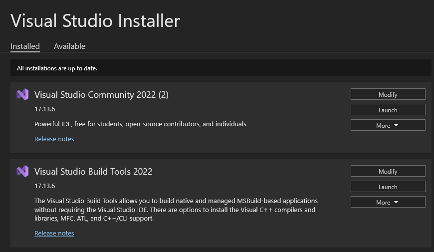
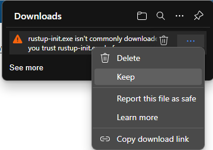
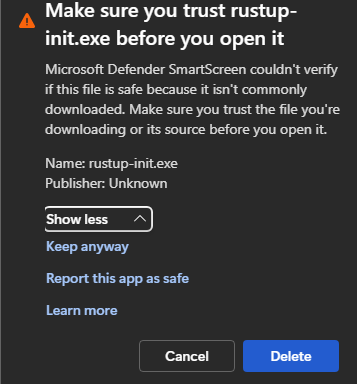

<p align="center"><a href="https://seequent.com" target="_blank"><picture><source media="(prefers-color-scheme: dark)" srcset="https://developer.seequent.com/img/seequent-logo-dark.svg" alt="Seequent logo" width="400" /></picture></a></p>
<p align="center">
    <a href="https://pypi.org/project/evo-data-converters-omf/"></a>
    <a href="https://github.com/SeequentEvo/evo-data-converters/actions/workflows/on-merge.yaml"></a>
</p>
<p align="center">
    <a href="https://developer.seequent.com/" target="_blank">Seequent Developer Portal</a>
    &bull; <a href="https://community.seequent.com/" target="_blank">Seequent Community</a>
    &bull; <a href="https://seequent.com" target="_blank">Seequent website</a>
</p>

## Evo

Evo is a unified platform for geoscience teams. It enables access, connection, computation, and management of subsurface data. This empowers better decision-making, simplified collaboration, and accelerated innovation. Evo is built on open APIs, allowing developers to build custom integrations and applications. Our open schemas, code examples, and SDK are available for the community to use and extend. 

Evo is powered by Seequent, a Bentley organisation.

## Pre-requisites

* Python virtual environment with Python 3.10, 3.11, or 3.12
* Git

## Installation

The `omf` data-converter package depends upon the `omf2` package which is not yet available in PyPI. 

Follow the steps below to install the `omf` data-converter package for your operating system.

### Windows
1. Install the Visual Studio 2022 C++ build tools (Community edition) from [Download Visual Studio Tools](https://visualstudio.microsoft.com/downloads/). 
1. Run the Visual Studio installer and follow the instructions until you reach this screen:
    

1. Under **Visual Studio Build Tools 2022**, click the **Modify** button.
1. Tick the box for **Desktop development with C++** and then click the button in the bottom right corner to install it. NOTE: The installation requires several GB of disk space and may take several minutes to complete.
   

1. Download the 64-bit Rust install from [Install Rust](https://www.rust-lang.org/tools/install).

1. If your web browser shows this error, follow the steps below:
    <br>
    

    a. Click the three dots and then click <b>Keep</b>.
    <br>
    

    b. Expand the options and click <b>Keep anyway</b>.
    <br>
    

1. Run the Rust installer and follow the instructions.

	a. Enter **y** when asked if you want to proceed.

    b. Enter **1** to proceed with the standard installation.

    c. Press **Enter** when installation is complete.

1. Open your terminal and switch to the folder containing your Python environment.

        cd C:\Users\<username>\path\to\sample\code
1. Check to see if your Python virtual environment is activated.

        `echo $env:VIRTUAL_ENV`
1. Check the resulting output. If the file path for your virtual environment is not shown, enter the following command to activate it.

        .\.venv\Scripts\activate
1. Download the **omf source code** from GitHub.

        pip install -e "git+https://github.com/gmggroup/omf-rust.git#egg=omf2&subdirectory=omf-python"
1. Install the **evo-data-converters** package.

        pip install evo-data-converters
1. The **omf package** will compile and install into your Python environment.

### macOS
1. Open your terminal app.
2. Install the **Xcode build tools** by entering the command in the terminal window and follow the instructions. If you already have the Xcode tools, you will see an warning message that you can ignore.

        xcode-select --install  
3. Install the **Rust build tools** by entering this command in the terminal window and following the instructions.

        curl --proto '=https' --tlsv1.2 https://sh.rustup.rs -sSf | sh
4. If required, switch to the folder containing your Python environment.

        cd ~/path/to/sample/code
5. Ensure your virtual environment is activated.

        where python
6. Check the resulting output. If the file path for your virtual environment is not printed, enter the following command to activate it.

        source ./.venv/bin/activate
7. Download the **omf source code** from GitHub.

        pip install -e "git+https://github.com/gmggroup/omf-rust.git#egg=omf2&subdirectory=omf-python"
8. Install the **evo-data-converters** package.

        pip install evo-data-converters
9. The **omf package** will compile and install into your Python environment.

## OMF

Open Mining Format (OMF) is a standard backed by the Global Mining Guidelines Group.

Refer here for more information: https://omf.readthedocs.io/en/latest/

To work with OMF files the `omf2` module is used, which is a Python interface to the `omf_rust` package:

https://github.com/gmggroup/omf-rust

### Publish geoscience objects from an OMF file
**Note**: For some OMF geometry types there is more than one possible way they could be converted to geoscience objects. For example, an OMF `LineSet` can be used to represent more than one thing (poly-lines, drillholes, a wireframe mesh, etc). In this example they are converted to `LineSegments`. Depending on your use case, you may want to convert them to a different geoscience object.

[The `evo-sdk-common` Python library](https://pypi.org/project/evo-sdk-common/) can be used to sign in. After successfully signing in, the user can select an organisation, an Evo hub, and a workspace. Use [`evo-objects`](https://pypi.org/project/evo-objects/) to get an `ObjectAPIClient`, and [`evo-data-converters-common`](https://pypi.org/project/evo-data-converters-common/) to convert your file.

Choose the OMF file you want to publish and set its path in the `omf_file` variable.
Choose an EPSG code to use for the Coordinate Reference System.

You can also specify tags to add to the created geoscience objects.

Then call `convert_omf`, passing it the OMF file path, EPSG code, the `ObjectAPIClient` from above, and finally a path you want the published objects to appear under in your workspace.

**Note:** Some geometry types are not yet supported. A warning will be shown for each element that could not be converted.

```python
import os
import pprint

from evo.aio import AioTransport
from evo.common import APIConnector
from evo.common.utils import BackoffIncremental
from evo.data_converters.omf.importer import convert_omf
from evo.discovery import DiscoveryAPIClient
from evo.oauth import AuthorizationCodeAuthorizer, OIDCConnector
from evo.objects import ObjectAPIClient
from evo.workspaces import WorkspaceAPIClient

# Configure the transport.
transport = AioTransport(
    user_agent="evo-sdk-common-example",
    max_attempts=3,
    backoff_method=BackoffIncremental(2),
    num_pools=4,
    verify_ssl=True,
)

# Login to the Evo platform.
# User Login
authorizer = AuthorizationCodeAuthorizer(
    redirect_url="<redirect_url>",
    oidc_connector=OIDCConnector(
        transport=transport,
        oidc_issuer="<issuer_url>",
        client_id="<client_id>",
    ),
)
await authorizer.login()

# Select an Organization.
async with APIConnector("https://discover.api.seequent.com", transport, authorizer) as api_connector:
    discovery_client = DiscoveryAPIClient(api_connector)
    organizations = await discovery_client.list_organizations()

selected_org = organizations[0]

# Select a hub and create a connector.
hub_connector = APIConnector(selected_org.hubs[0].url, transport, authorizer)

# Select a Workspace.
async with hub_connector:
    workspace_client = WorkspaceAPIClient(hub_connector, selected_org.id)
    workspaces = await workspace_client.list_workspaces()

workspace = workspaces[0]
workspace_env = workspace.get_environment()

# Convert your object.
async with hub_connector:
    service_client = ObjectAPIClient(workspace_env, hub_connector)
    omf_file = os.path.join(os.getcwd(), "data/input/one_of_everything.omf")
    epsg_code = 32650

    tags = {"TagName": "Tag value"}

    objects_metadata = convert_omf(
        filepath=omf_file,
        epsg_code=epsg_code,
        object_service_client=service_client,
        tags=tags,
        upload_path="path/to/my/object"
    )

    print("These objects have now been published:")
    for metadata in objects_metadata:
        pprint.pp(metadata, indent=4)
```

### Export objects to OMF

To export an object from Evo to an OMF file, specify the Evo object UUID of the object you want to export and the output file path, and then call `export_omf()`.
See documentation on the `ObjectAPIClient` for listing objects and getting their IDs and versions.

You may also specify the version of this object to export. If not specified, so it will export the latest version.

You will need the same selection of organisation, Evo hub, and workspace that is needed for importing objects.

**Note**: Some geoscience object types are not yet supported.

```python
import os
from uuid import UUID

from evo.data_converters.common import EvoObjectMetadata
from evo.data_converters.omf.exporter import export_omf

objects = []
objects.append(
    EvoObjectMetadata(
        object_id=UUID("<object_id>"),
        version_id="<version_id>"))

output_dir = "data/output"
os.makedirs(output_dir, exist_ok=True)

output_file = f"{output_dir}/object.omf"

export_omf(
    filepath=output_file,
    objects=objects,
    service_client=service_client,
)
```

### Block models

[Block models](https://developer.seequent.com/docs/guides/blockmodel) can be imported using the standard `convert_omf` function.

Block models work a little bit differently for export. These use a `BlockSyncClient` rather than the `ObjectAPIClient` to access models stored in BlockSync. Create a `BlockSyncClient` using the Environment and APIConnector in the same way you would create and `ObjectAPIClient`.

```python
from evo.data_converters.common import BlockSyncClient

blocksync_client = BlockSyncClient(workspace_env, hub_connector)
```

#### Export a block model to OMF V1

Specify the block model UUID of the block model object you want to export and the output file path, then call `export_blocksync_omf()`.

**Note**: At this stage only Regular block model types are supported.

```python
import os
from uuid import UUID

from evo.data_converters.omf.exporter import export_blocksync_omf

object_id = ""
version_id = None

output_dir = "data/output"
os.makedirs(output_dir, exist_ok=True)

output_file = f"{output_dir}/{object_id}.omf"

export_blocksync_omf(
    filepath=output_file,
    object_id=UUID(object_id),
    version_id=version_id,
    service_client=blocksync_client,
)

print(f"File saved to {output_file}")
```

### Download Parquet file only

```python
import shutil

import pyarrow.parquet as pq

object_id = ""
dest_file = f"data/output/{object_id}.parquet"

job_url = blocksync_client.get_blockmodel_columns_job_url(object_id)
download_url = blocksync_client.get_blockmodel_columns_download_url(job_url)
downloaded_file = blocksync_client.download_parquet(download_url)

shutil.copy(downloaded_file.name, dest_file)

table = pq.read_table(dest_file)

for column in table.column_names:
    print(f"{column} is of type: {table.schema.field(column).type}")
```

## Code of conduct

We rely on an open, friendly, inclusive environment. To help us ensure this remains possible, please familiarise yourself with our [code of conduct.](https://github.com/SeequentEvo/evo-data-converters/blob/main/CODE_OF_CONDUCT.md)

## License
Evo data converters are open source and licensed under the [Apache 2.0 license.](./LICENSE.md)

Copyright © 2025 Bentley Systems, Incorporated.

Licensed under the Apache License, Version 2.0 (the "License").
You may obtain a copy of the License at

    http://www.apache.org/licenses/LICENSE-2.0

Unless required by applicable law or agreed to in writing, software
distributed under the License is distributed on an "AS IS" BASIS,
WITHOUT WARRANTIES OR CONDITIONS OF ANY KIND, either express or implied.
See the License for the specific language governing permissions and
limitations under the License.
